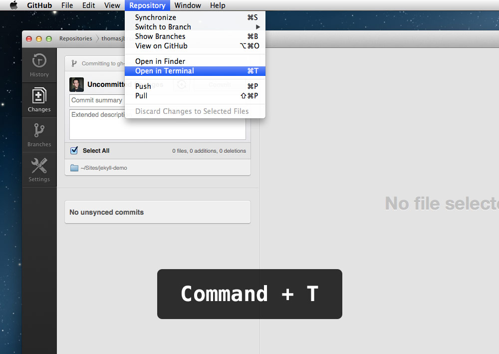
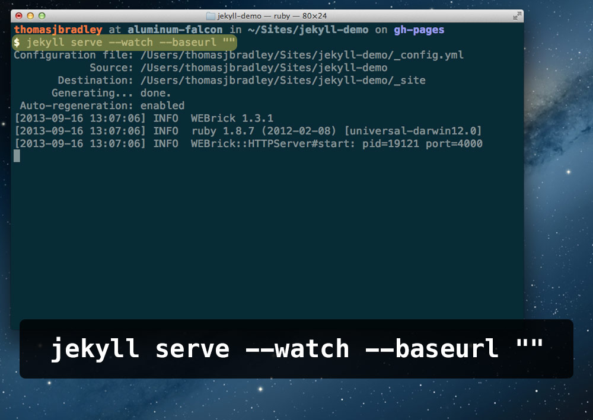
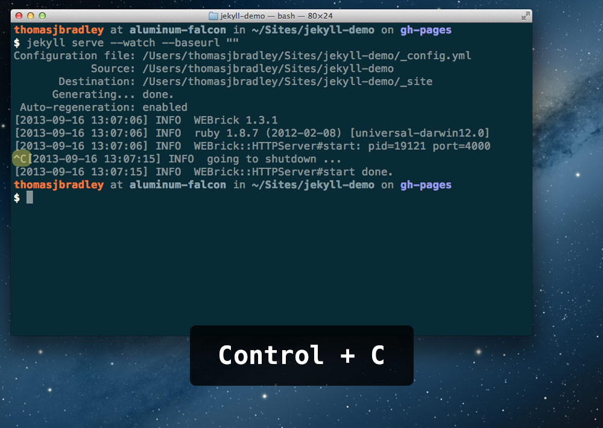

# Jekyll command line cheat sheet

This cheat sheet assumes running Jekyll on GitHub Pages and that you’ve followed the setup directions here: <http://jekyllrb.com/docs/github-pages/>

## ☛ Open folder in Terminal

Click `Repository > Open in Terminal` in the GitHub application.



**Or** press `Command+T`.

## ☛ Run Jekyll

```sh
$ jekyll serve --watch --baseurl ""
```



Jekyll will now be available in your browser at the following URL: **<http://localhost:4000>**

## ☛ Stop Jekyll

```
Control+C
```



**Or** just quit Terminal.